# Modern Observability Stack for Cell-Based Architecture

**Engine Repository**: [ci-cd-templates](https://github.com/bmsj5/ci-cd-templates) - Contains Ansible playbooks, Helm values, and OTel collector configurations.

### Deployment Configurations
- **OTel Collectors**: [helm-charts/otel-collector/](https://github.com/bmsj5/ci-cd-templates/tree/main/helm-charts/otel-collector)
  - Gateway: `values-gateway.yml`
  - Backend: `values-backend.yml`
  - API Server: `values-apiserver.yml`
- **VictoriaMetrics**: [helm-charts/victoria-metrics/values.yml](https://github.com/bmsj5/ci-cd-templates/blob/main/helm-charts/victoria-metrics/values.yml)
- **Tempo**: [helm-charts/tempo/values.yml](https://github.com/bmsj5/ci-cd-templates/blob/main/helm-charts/tempo/values.yml)
- **OpenObserve**: [helm-charts/openobserve/values.yml](https://github.com/bmsj5/ci-cd-templates/blob/main/helm-charts/openobserve/values.yml)
- **Grafana**: [helm-charts/grafana/values.yml](https://github.com/bmsj5/ci-cd-templates/blob/main/helm-charts/grafana)

## OTel Collector Unification

Single OTel collector replaces multiple exporters:
- **Kubelet metrics** → `kubeletstats` receiver
- **MongoDB metrics** → `prometheus` receiver with k8s service discovery
- **Redis metrics** → `prometheus` receiver with k8s service discovery
- **RabbitMQ metrics** → `prometheus` receiver with k8s service discovery
- **CoreDNS metrics** → `prometheus` receiver with k8s service discovery
- **Traefik metrics** → `prometheus` receiver with k8s service discovery
- **Kube-state-metrics** → `prometheus` receiver with k8s service discovery
- **API server metrics** → Dedicated collector with bearer token auth

## Dashboard Features

### Infrastructure Metrics
- **MongoDB**: Connections, operations, memory, replication status
- **Redis**: Memory usage, connections, commands, keyspace metrics
- **RabbitMQ**: Queues, connections, exchanges, message rates

### Kubernetes System Metrics
- **API Server**: Request rates, latency, deprecated API usage
- **CoreDNS**: Query rates, response times, cache performance
- **Traefik**: Request rates, duration, configuration reloads

### Kubernetes Views
- **Global**: Cluster-wide resource utilization
- **Namespaces**: Namespace-specific metrics and quotas
- **Nodes**: Individual node performance and capacity
- **Pods**: Container metrics and resource usage

### Observability
- **Logs**: Centralized logging with OpenObserve
- **Traces**: Distributed tracing with Tempo

## Dashboards

| Dashboard | Description | Screenshot |
|-----------|-------------|------------|
| **Infrastructure Metrics** | | |
| `MongoDB.json` | MongoDB performance metrics: connections, operations, memory, replication | 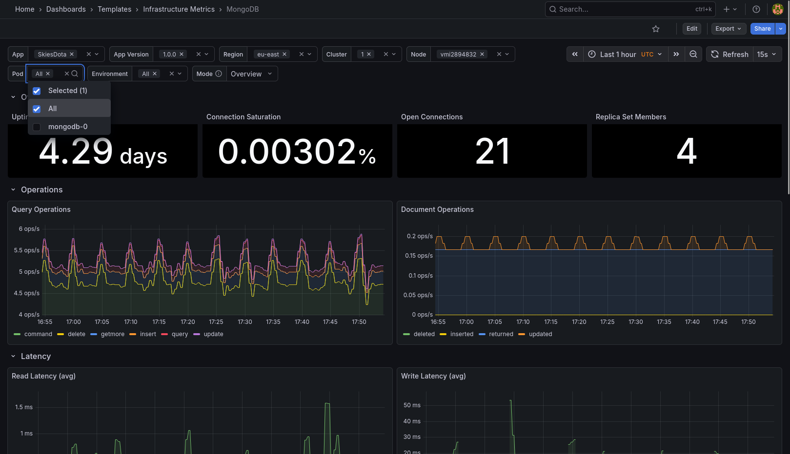 |
| `Redis.json` | Redis performance metrics: memory usage, connections, commands, keyspace | 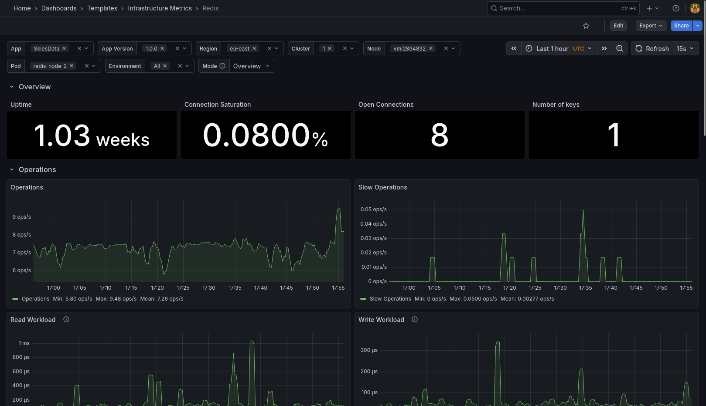 |
| `RabbitMQ.json` | RabbitMQ messaging metrics: queues, connections, exchanges, message rates | 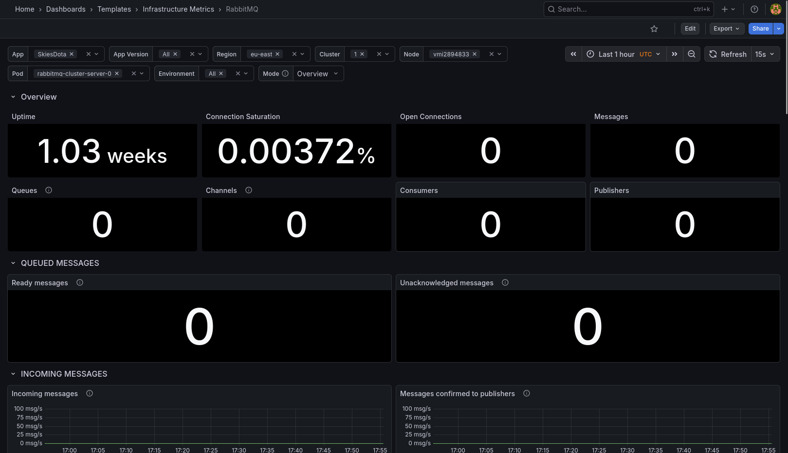 |
| **Kubernetes System Metrics** | | |
| `API Server.json` | Kubernetes API Server metrics: request rates, latency, deprecated API usage | 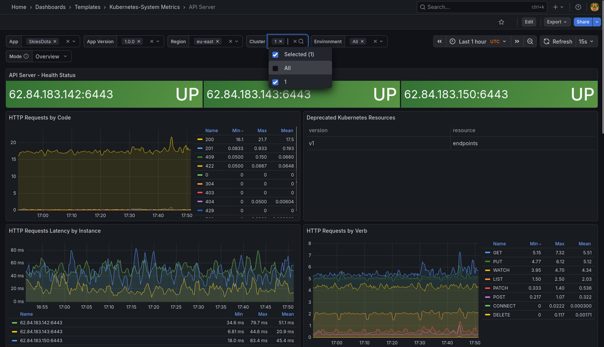 |
| `CoreDNS.json` | CoreDNS metrics: query rates, response times, cache performance | 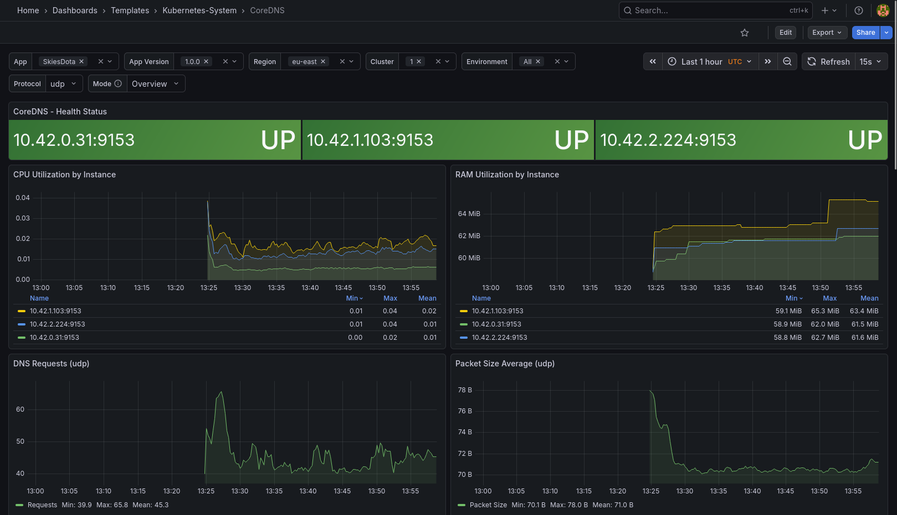 |
| `Traefik.json` | Traefik ingress metrics: request rates, duration, configuration reloads | 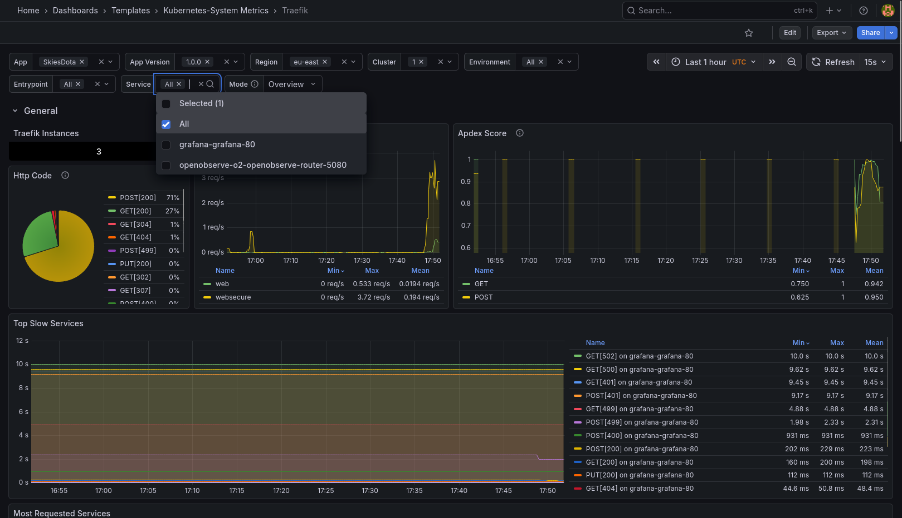 |
| **Kubernetes Views** | | |
| `Global.json` | Cluster-wide resource utilization overview | 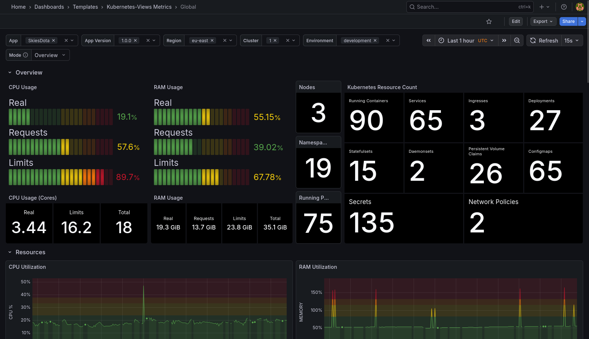 |
| `Namespaces.json` | Namespace-specific metrics and resource quotas | 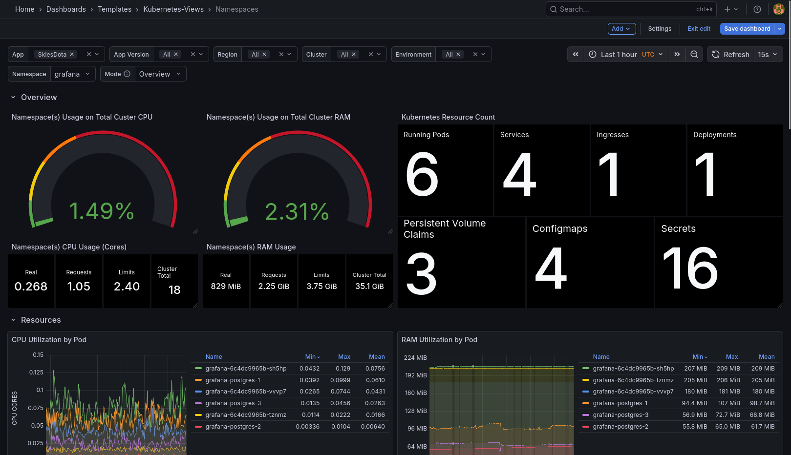 |
| `Nodes.json` | Individual node performance and capacity metrics | 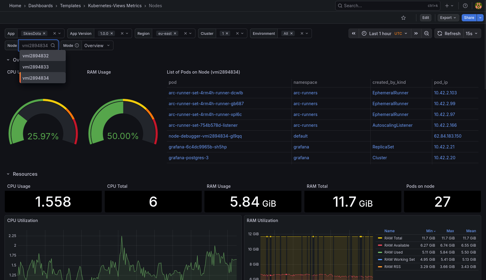 |
| `Pods.json` | Container and pod resource usage metrics | 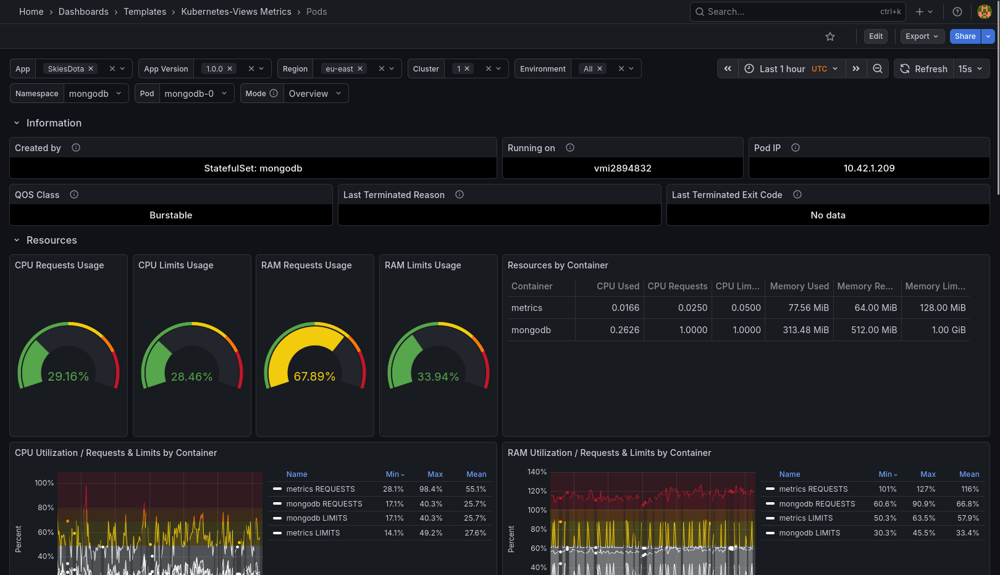 |
| **Observability** | | |
| `Logs.json` | Centralized logging interface with OpenObserve | 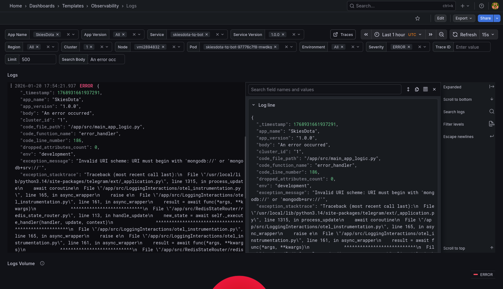 |
| `Traces.json` | Distributed tracing interface with Tempo | 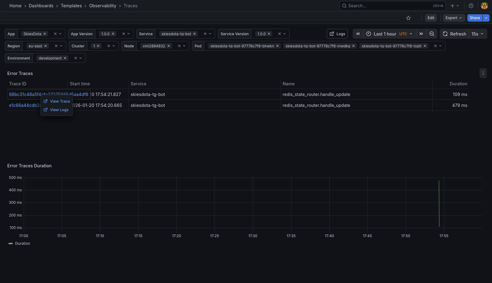 |

## Resource Attributes

All metrics are enriched with consistent resource attributes for unified observability across the entire stack. These attributes enable powerful filtering, grouping, and correlation capabilities in Grafana dashboards.

### Attribute Configuration

Attributes are injected via environment variables in the OTel collector Helm chart:

| Attribute | Environment Variable | Example | Purpose |
|-----------|---------------------|---------|---------|
| `app.name` | `APP_NAME` | `"Name"` | Application name |
| `app.version` | `APP_VERSION` | `"v1.2.3"` | Application version |
| `region` | `REGION` | `"us-west"` | Geographic region |
| `cluster.id` | `CLUSTER_ID` | `"1"` | Unique cluster identifier |
| `env` | `DEPLOYMENT_ENV` | `"development"` | Deployment environment |

### Pipeline Implementation

The OTel collector applies these attributes through a processing pipeline:

1. **Environment Variable Injection**: Attributes sourced from ConfigMaps and Secrets
2. **Resource Processor**: Adds static resource attributes to all telemetry data
3. **k8sattributes Processor**: Extracts dynamic Kubernetes metadata:
   - `k8s.pod.name` - Pod name
   - `k8s.namespace.name` - Namespace
   - `k8s.node.name` - Node name

## Architecture

```
Kubernetes Services ── OTel Collectors ── Storage ── Grafana
     ├── MongoDB          ├── Gateway       ├── VictoriaMetrics (metrics)
     ├── Redis            ├── Backend       ├── Tempo (traces)
     ├── RabbitMQ         └── API Server    └── OpenObserve (logs)
     └── CoreDNS
```